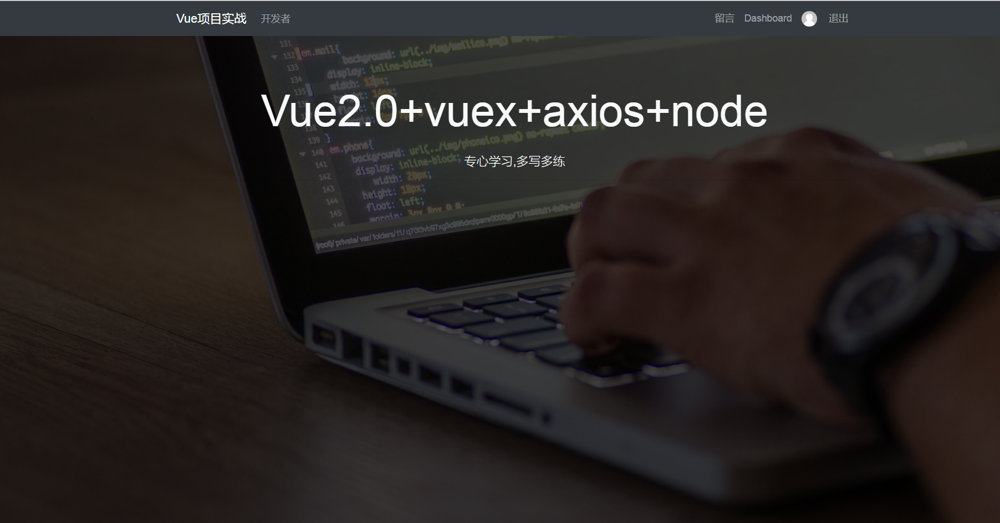
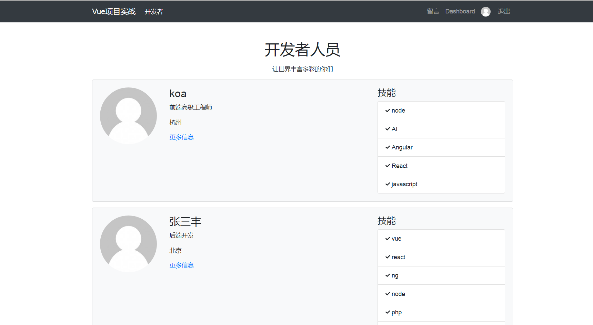

# vue2.0+axios+vuex+node.js+mongoDB+express+bootstrap

### 说明:
> 项目中所有的数据来源，使用node+express搭建数据接口,mongoDB+mlab存储数据。
> 使用vue2.0对数据的请求，实现数据的增删改查，处理登录token问题，请求拦截，数据管理，组件封装

### 相关技术
1. vuejs2.0：一套构建用户界面的渐进式框架，易用、灵活、高效。
2. vue-router：官方的路由组件，配合vue.js创建单页应用（SPA）非常简单。
3. axios: 基于 Promise 的 HTTP 请求客户端，可同时在浏览器和 node.js 中使用。
4. jwt-decode: token解析

### 项目编译和运行

``` bash
1.如果想运行项目。需要先下载node接口代码，
git@github.com:MrZHLF/node-vue.git
2. 可以直接在git上下载项目源码。把github下载到本地(vue项目，下载文件放到node目录里面)，
     git@github.com:MrZHLF/vue-node.git	
3.项目初始化，下载所需要的依赖(现在node目录初始化一次，在进入vue项目目录初始化一下)
	 cnpm install
4.项目运行(在node目录进行运行，不要进行vue项目中运行,)
	cnpm run dev
	
5如果想看到效果，这两个文件都需要下载，才能看到效果
```

## 成果展示




